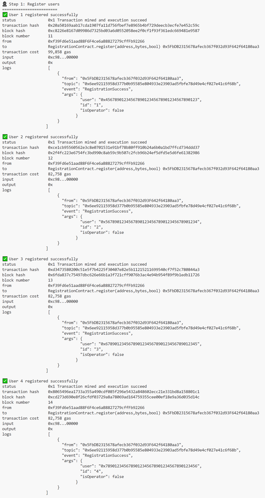

# Blockchain-based proportional fair scheduling algorithm

[中文](README_zh.md) | English

This repository contains the source code of BC-PFS proposed in the paper `Blockchain-based Proportional Fair Scheduling`. We provide four types of smart contracts (registration, status reporting, scheduling, settlement) and a series of operation tools, supporting user and operator registration, on-chain storage of user rate data, BC-PFS algorithm implementation, and scheduling fee settlement, which can effectively support the verification work of BC-PFS in actual experimental environments.

## 1. Platform architecture

### 1.1 Overall architecture

<p align="center"></p>

This platform collaborates with on-chain smart contracts and off-chain operation tools. Smart contracts are responsible for executing core business logic and maintaining state changes, while operation tools interact with blockchain through interfaces, responsible for process orchestration and data output.

#### On-chain smart contracts

-  `RegistrationContract` : Manages user and operator registration, maintains user and operator lists
-  `StatusReportingContract` : Reports user CSI data, calculates and maintains user rate data
-  `SchedulingContract` : Implements scheduling algorithm, selects users to be scheduled for each operator, and updates user throughput
-  `SettlementContract` : Calculates service fees and completes fee settlement

#### Off-chain scripts and tools

- `bcpfs-init.js`: Deploys contracts and completes contract address association
- `bcpfs-runner.js`: Executes multi-round user scheduling in a loop, where each round includes the complete process of "reporting → scheduling → settlement"
- `transaction-viewer.js`: Formats and outputs transaction information
- `progress-monitor.js`: Real-time tracking and display of runtime progress


### 1.2 Prerequisites

- Node.js v22.10.0
- Dependencies as specified in `package.json`

Please install dependencies before first run:

```bash
npm install
```

## 2. **Workflow** 

Run the following command from the project root directory to start this platform:

```
npx hardhat run bcpfs-runner.js 
```

### 2.1 Platform initialization

During initialization,  `bcpfs-runner.js` will call `bcpfs-init.js` to complete contract deployment and contract association configuration.


#### 2.1.1 Contract deployment

```javascript
// 1. Deploy registration contract
const RegistrationContract = await ethers.getContractFactory("RegistrationContract");
registrationContract = await RegistrationContract.deploy();

// 2. Deploy status reporting contract
const StatusReportingContract = await ethers.getContractFactory("StatusReportingContract");
statusReportingContract = await StatusReportingContract.deploy();

// 3. Deploy scheduling contract
const SchedulingContract = await ethers.getContractFactory("SchedulingContract");
schedulingContract = await SchedulingContract.deploy();

// 4. Deploy settlement contract
const SettlementContract = await ethers.getContractFactory("SettlementContract");
settlementContract = await SettlementContract.deploy();
```

##### Contract deployment output

<p align="center"></p>

#### 2.1.2 Contract association configuration

```javascript
// Configure scheduling contract dependencies
await schedulingContract.setStatusReportingContract(statusReportingContract.address);
await schedulingContract.setRegistrationContract(registrationContract.address);
await settlementContract.setSchedulingContract(schedulingContract.address);
await settlementContract.setRegistrationContract(registrationContract.address);
```

##### Contract association configuration output

<p align="center"></p>

### 2.2 Running multi-round user scheduling

**Parameter settings**: 

- **Number of Networks**: 2
- **Total Users**: 4
- **Total Scheduling Rounds**: 60,000
- **Scheduling Interval**: 50ms
- **Channel Coherence Time**: 50ms

**Scheduling mode**: Each operator selects 1 user for service in each round (within each scheduling interval), with 4 users competing for service resources from 2 operators.

After platform initialization, `bcpfs-runner.js` will continue to automatically run multi-round user scheduling, executing the complete blockchain-based proportional fair scheduling process, including registration, status reporting, user scheduling, and settlement.

#### 2.2.1 Step 1: Operator and user registration

```javascript
// Register operators
await registrationContract.register(operator1, operatorProof, true);
await registrationContract.register(operator2, operatorProof, true);

// Register users
for (let i = 0; i < 4; i++) {
    await registrationContract.register(users[i], userProof, false);
}
```

##### Operator and user registration output

<p align="center"></p>
<p align="center"></p>

#### 2.2.2 Step 2: User status reporting

Report CSI data of users at each operator for the current round, and the status reporting contract estimates the user rates at each operator.

```javascript
const ratePromises = users.flatMap((user, i) => 
        operators.map((operator, j) => {
            const csiData = generateCSIData(i + 1, j);
            return statusReportingContract.submitReport(user, operator, csiData);
        })
    );
await Promise.all(ratePromises);
```

**CSI data reporting output**

Note: The following results are obtained from round 500 of the scheduling process, which serves as an example. All subsequent user scheduling and settlement transaction outputs are based on the data from this round.

   <p align="center"></p>

 - The transaction receipt shows block information, and the `ReportSubmitted` event log records user and operator (`user`, `operator`) addresses, the current round user rate `rate` calculated based on CSI, and the event timestamp `timestamp`.

 - User rates at each operator:

       <p align="center"></p>

#### 2.2.3 Step 3: User scheduling

Scheduling calculates user priority based on "current round latest user rate + previous round user throughput". Each operator will select the user with the highest corresponding priority to provide service.

```javascript
await schedulingContract.updateScheduling();
```
**User scheduling output**

   <p align="center"></p>

  - The transaction receipt shows the selected users (`selectedUsers`) corresponding to each operator (`operators`) in the current round, confirming which users each operator will provide resources for in this round.

  - **Scheduling priority algorithm:**
    
    - `priority = latestRate / lastRoundThroughput`
    
  - **End-of-round throughput update algorithm:**
    
    - Summarize the rates allocated to users by each operator in this round: `totalAllocated`
    - Current round user throughput: `newThroughput = (1-alpha) * lastRoundThroughput + alpha * totalAllocated`, (`alpha` =0.0001)
    
  - **Scheduling priority and throughput update calculation:**
    
    - User priorities at each operator are:
    
         <p align="center"></p>
    
      Among them, User 2 has the highest priority at Operator 1, and User 4 has the highest priority at Operator 2
    
    - Based on priority ranking, the scheduling result is:
    
         <p align="center"></p>
    
    - After this round of scheduling completion, user throughput updates to:
    
   <p align="center"></p>

#### 2.2.4 Step 4: Transaction settlement

```javascript
await settlementContract.processScheduledTransactions();
```

**Transaction settlement output**

<p align="center"></p>

- The event log in the transaction receipt records service  `duration`,  `bandwidth` (event `ServiceNotified`) and settlement `cost` (event `PaymentProcessed`), indicating that the scheduled users and corresponding operators in this round have completed service notification and fee settlement.

### 2.3 Sample running results

The platform completed a total of 60,000 rounds of user scheduling, and the final user throughput results are:

<p align="center"></p>

User throughput variation curve with scheduling rounds:

<p align="center"></p>

Results show that user throughput gradually converges to a steady state during the scheduling process, and the system achieves good overall performance while ensuring fairness in user resource allocation.

## 3. Conclusion

This platform implements the complete deployment and verification of the BC-PFS scheme proposed in the paper. It develops four types of Solidity smart contracts: registration, status reporting, scheduling, and settlement, and implements and tests them in an Ethereum-compatible environment (Hardhat). This platform not only verifies the technical feasibility of BC-PFS but also provides important engineering practice references for blockchain-based wireless network resource scheduling.
