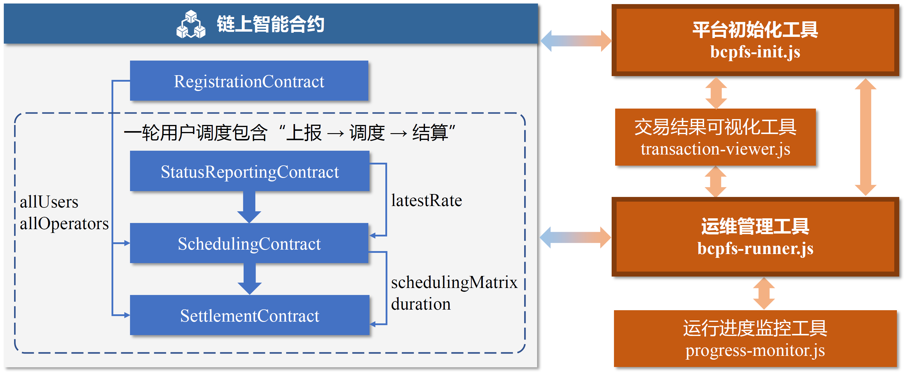
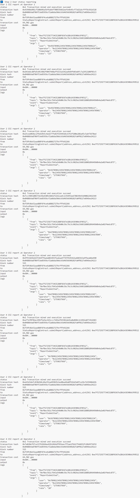
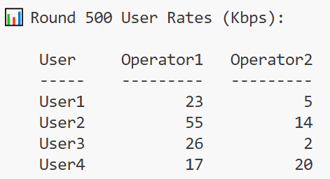
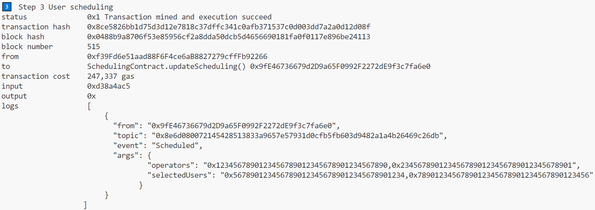
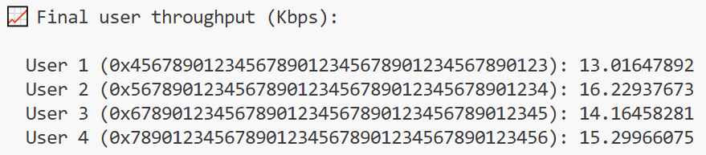
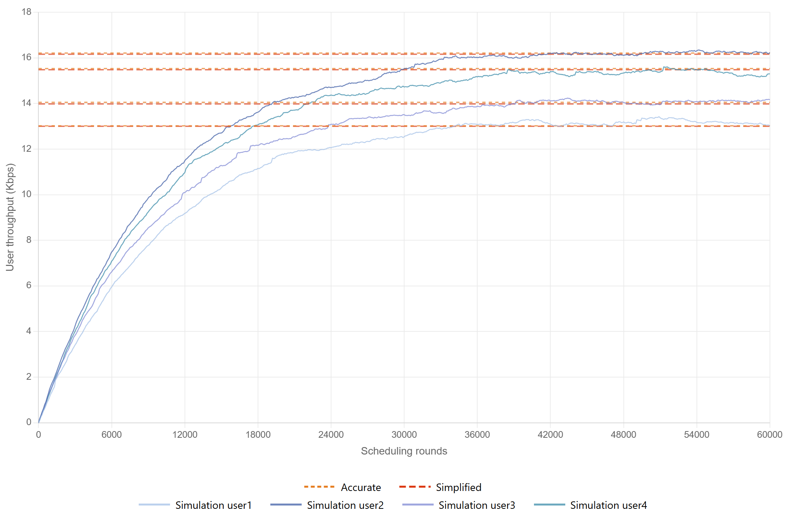

# 基于区块链的比例公平调度算法

中文 | [English](README.md)

本仓库提供了论文 `Blockchain-based Proportional Fair Scheduling` 中提出的BC-PFS源码。平台包含四类智能合约（注册、状态上报、调度、结算）与一组链下工具，支持用户/运营商注册、用户速率数据链上存储、基于区块链的比例公平调度算法实现、调度费用结算等关键功能，能够有效支撑 BC-PFS 在实际试验环境中的验证工作。

## 1. 平台架构

### 1.1 整体架构

<p align="center"></p>

本平台由链上智能合约与链下运行工具协同，智能合约负责执行核心业务逻辑，并维护状态变更，运行工具通过接口与链上交互，负责流程编排与数据输出。

#### 链上智能合约

-  `RegistrationContract` ：管理用户和运营商注册，维护用户和运营商列表
-  `StatusReportingContract` ：上报用户CSI 数据、计算并维护用户速率数据
-  `SchedulingContract` ：实现调度算法，为每个运营商选出待调度用户，更新用户吞吐量
-  `SettlementContract` ：计算服务费用并完成费用结算

#### 运行脚本与工具

- `bcpfs-init.js`：部署合约并完成合约地址关联
- `bcpfs-runner.js`：循环执行多轮用户调度，其中每一轮包含“上报→调度→结算”完整流程
- `transaction-viewer.js`：格式化输出交易信息
- `progress-monitor.js`：实时跟进并显示运行进度


### 1.2 准备工作

- Node.js v22.10.0
-  `package.json` 中的依赖项

首次运行前，请通过下面命令安装依赖：

```bash
npm install
```

## 2. 运行流程

从项目根目录运行以下命令来启动本平台：

```
npx hardhat run bcpfs-runner.js 
```

### 2.1 平台初始化

首先进行平台初始化，`bcpfs-runner.js` 将调用 `bcpfs-init.js` 完成合约部署与合约关联配置。


#### 2.1.1 合约部署

```javascript
// 1. 部署注册合约
const RegistrationContract = await ethers.getContractFactory("RegistrationContract");
registrationContract = await RegistrationContract.deploy();

// 2. 部署状态报告合约
const StatusReportingContract = await ethers.getContractFactory("StatusReportingContract");
statusReportingContract = await StatusReportingContract.deploy();

// 3. 部署调度合约
const SchedulingContract = await ethers.getContractFactory("SchedulingContract");
schedulingContract = await SchedulingContract.deploy();

// 4. 部署结算合约
const SettlementContract = await ethers.getContractFactory("SettlementContract");
settlementContract = await SettlementContract.deploy();
```

##### 合约部署运行结果

<p align="center"></p>

#### 2.1.2 合约关联配置

```javascript
// 配置调度合约的依赖关系
await schedulingContract.setStatusReportingContract(statusReportingContract.address);
await schedulingContract.setRegistrationContract(registrationContract.address);
await settlementContract.setSchedulingContract(schedulingContract.address);
await settlementContract.setRegistrationContract(registrationContract.address);
```

##### 合约关联配置运行结果

<p align="center"></p>

### 2.2 运行多轮用户调度

**参数设置**: 

- **网络数**: 2
- **总用户数**: 4
- **调度总轮数**: 60000
- **调度间隔**: 50ms
- **信道相干时间**: 50ms

**调度模式**: 每个运营商在每轮（每调度间隔内）中选择1个用户进行服务，4个用户竞争2个运营商的服务资源。

`bcpfs-runner.js`在完成平台初始化后，将继续自动运行多轮用户调度，执行基于区块链的比例公平调度完整流程，包括注册、状态报告、用户调度和费用结算在内的所有步骤。

#### 2.2.1 步骤一：运营商和用户注册

```javascript
// 注册运营商
await registrationContract.register(operator1, operatorProof, true);
await registrationContract.register(operator2, operatorProof, true);

// 注册用户
for (let i = 0; i < 4; i++) {
    await registrationContract.register(users[i], userProof, false);
}
```

##### 运营商和用户注册运行结果

<p align="center"></p>
<p align="center"></p>

#### 2.2.2 步骤二：用户状态报告

上报当轮用户在各运营商处的CSI 数据，由状态报告合约估算得到当轮用户在各运营商处的速率。

```javascript
const ratePromises = users.flatMap((user, i) => 
        operators.map((operator, j) => {
            const csiData = generateCSIData(i + 1, j);
            return statusReportingContract.submitReport(user, operator, csiData);
        })
    );
await Promise.all(ratePromises);
```

**CSI数据上报运行结果**

注：本文以调度过程中的某一轮（第 500 轮）为例，展示该轮的运行结果，后续用户调度与结算交易的运行结果均引用该轮数据，不再赘述。

   <p align="center"></p>

 - 交易回执展示了区块信息，`ReportSubmitted` 事件日志记录了用户与运营商（`user`、`operator`）地址、根据 CSI 计算得出的本轮用户速率 `rate`，以及事件时间戳 `timestamp`。

 - 用户在各运营商处速率：

       <p align="center"></p>

#### 2.2.3 步骤三：用户调度

调度根据"本轮最新用户速率+ 上一轮用户吞吐量"计算用户优先级，每个运营商将选择其对应优先级最高的用户提供服务。

```javascript
await schedulingContract.updateScheduling();
```
**用户调度运行结果**

   <p align="center"></p>

  - 交易回执中展示当前轮每个运营商（`operators`）对应的选中用户（`selectedUsers`），据此可确认本轮各运营商为哪个用户提供资源。

  - **调度优先级算法：**
    
    - `priority = latestRate / lastRoundThroughput`
    
  - **轮末吞吐量更新算法：**
    
    - 汇总用户在本轮被各运营商分配的速率：`totalAllocated`
    - 本轮用户吞吐量：`newThroughput = (1-alpha) * lastRoundThroughput + alpha * totalAllocated`，(`alpha` =0.0001)
    
  - **调度优先级与吞吐量更新演算：**
    
    - 用户在各运营商处优先级为：
    
         <p align="center"></p>
    
      其中，运营商1处优先级最高的都是用户2，运营商2处优先级最高的都是用户4。
    
    - 根据优先级排序得到调度结果为：
    
         <p align="center"></p>
    
    - 本轮调度完成后的用户吞吐量更新为：
    

   <p align="center"></p>

#### 2.2.4 步骤四：交易结算

```javascript
await settlementContract.processScheduledTransactions();
```

**交易结算运行结果**

<p align="center"></p>

- 交易回执的事件日志记录了服务时长`duration`、带宽`bandwidth`（事件 `ServiceNotified`）与结算金额 `cost`（ 事件`PaymentProcessed`），表明本轮被调度的用户与对应运营商已完成服务通知与费用结算。

### 2.3 样例运行结果

平台共完成了60,000 轮用户调度，最终得到的用户吞吐量分别为：

<p align="center"></p>

用户吞吐量随调度轮数变化曲线图：

<p align="center"></p>

结果表明，用户吞吐量在调度过程中逐渐收敛至稳态，系统在保证用户资源分配公平性的同时实现了良好整体性能。

## 3. 结论

本平台实现了论文中提出的BC-PFS方案的完整部署与验证。开发了注册、状态上报、调度、结算四类Solidity智能合约，并在以太坊兼容环境（Hardhat）中进行实现与测试。本平台不仅验证了BC-PFS的技术可行性，也为基于区块链的无线网络资源调度提供了重要的工程实践参考。
